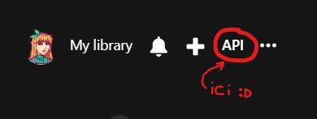

#  • 遊び記 - Asobi Ki •


Bienvenue sur **AsobiKi** ! C'est une toute petite application mobile permettant d'explorer des jeux vidéo, particulièrement des jeux japonais !

 Le nom Asobi Ki vient de Asobi (遊び) signifiant amusement, jeu, et Ki "記" journal ou chronique ! Cela pourrait se traduire par "Chronique de jeu" en français ! Je l'ai trouvé par hasard en cherchant des façons amusante d'appeler mon application avec une sonorité japonaise. 

---

## Les fonctionnalités

- Accueil avec boutons pour naviguer par les différents studios
- Barre de recherche sur l'accueil pour trouver un jeu en particulier
- Liste de jeux par studio (ex: pour Nintendo ➔ Mario, Zelda, etc.)
- Des détails d'un jeu (plateformes, genres, note, durée, etc.)
- Petite animations rétro lors du chargement des informations
- Design de l'app en style pixel art (cartouches de jeux rétro, vieille TV...)
---

## Technologies utilisées

- **React Native (Bare Workflow)**
- **RAWG API** : C'est l'API que j'ai utilisée pour récupérer les données des jeux ! Elle est gratuite et relativement simple à utiliser, je n'ai pas eu de souci particulier. 
- **react-navigation** pour la navigation entre les pages
- **.env** pour sécuriser la clé API RAWG
- **Mon telephone Android** pour tester l'app !

---

## L'installation

### Prérequis
- Avoir **Node.js** et **npm** installés
- Avoir **Android Studio** installé (ou un téléphone Android connecté en mode développeur USB)
- Avoir installé les outils React Native CLI (via `npx`)

---

### 1. La clé API

Alors, il va falloir récupérer votre propre clé API pour utiliser l'application ! Pour cela, allez sur [RAWG](https://rawg.io) et créez un compte. Ensuite, cliquez sur "API" en haut à droite 


Ca devrait vous mener [ici](https://rawg.io/apidocs) puis vous cliquez sur "Get API Key" et le tour est joué ! Vous n'avez plus qu'à copier votre clé dans un fichier `.env` comme expliqué dans le `.env.example` et vous êtes prêt à démarrer le projet ! 


```bash
#Vous clonez le projet puis vous vous rendez dans le dossier

npm install

npx react-native start --reset-cache #vous n'êtes pas obligé de vider le cache mais bon. 

#Connectez votre téléphone Android en mode développeur USB

#Lancer le projet 
npx react-native run-android
```

Voilà, voilà. L'application n'est pas du tout parfaite ni forcément magnifique visuellement mais j'ai apprécié la faire, je suis vraiment débutante en développement donc je m'aide de documentations, tutos mais bon, je comprends petit à petit ce qu'il faut faire etc, et c'est sans doute le plus important :) !


